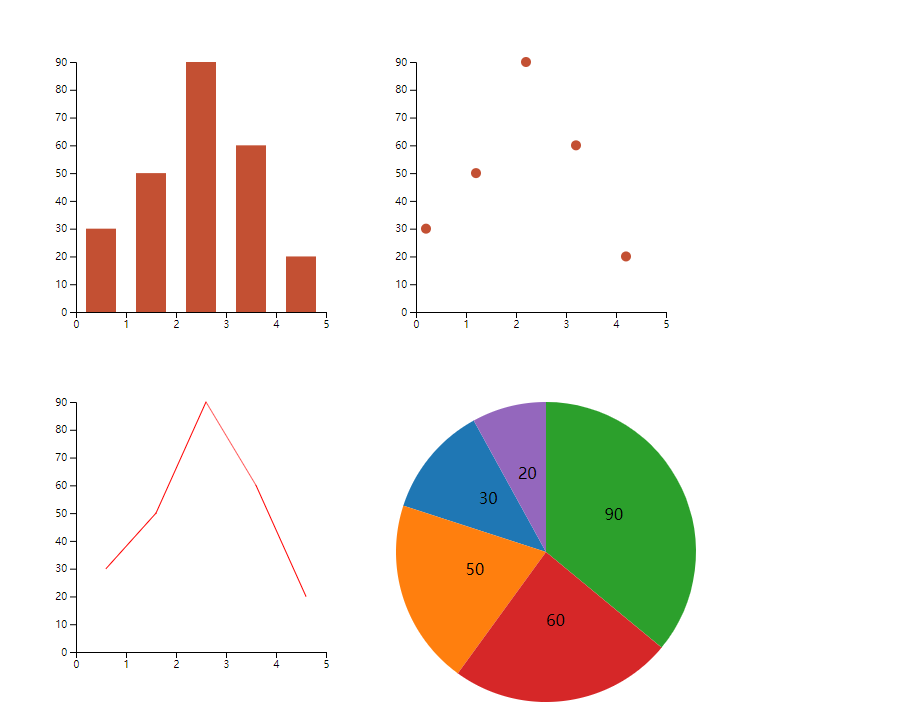
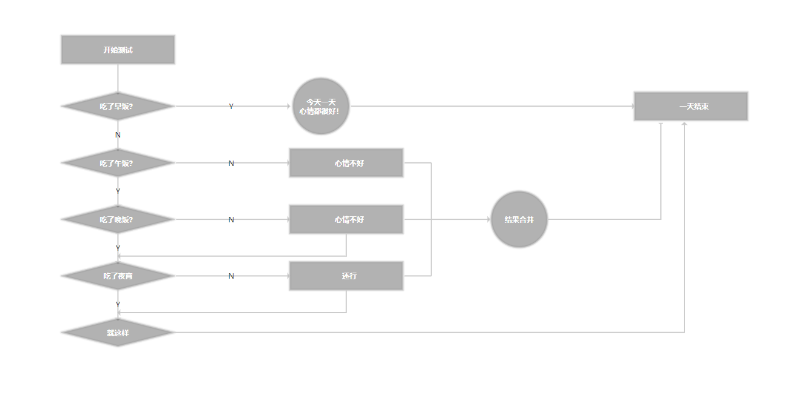
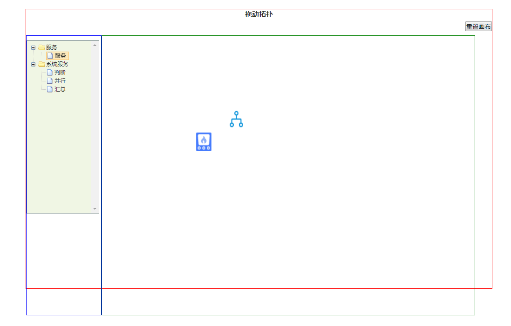
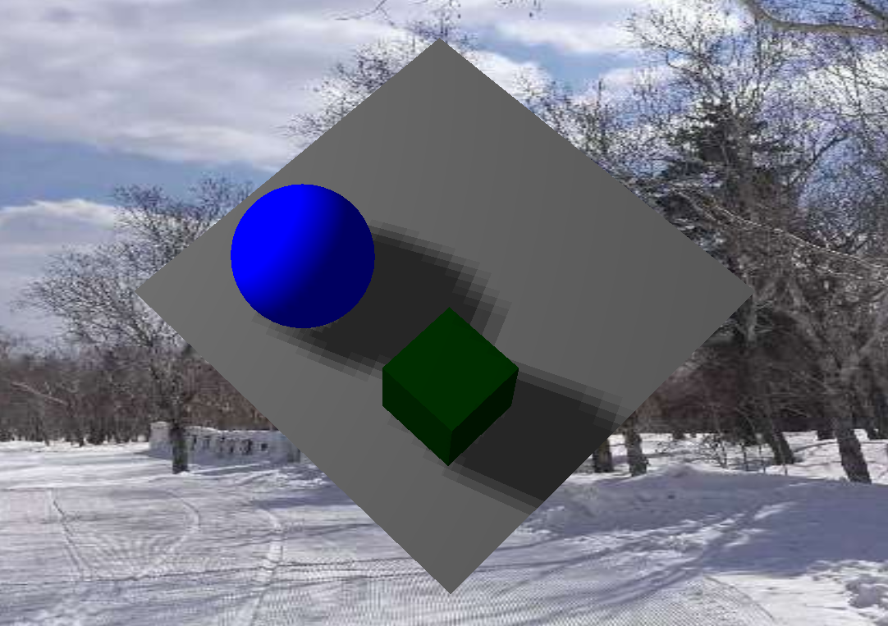
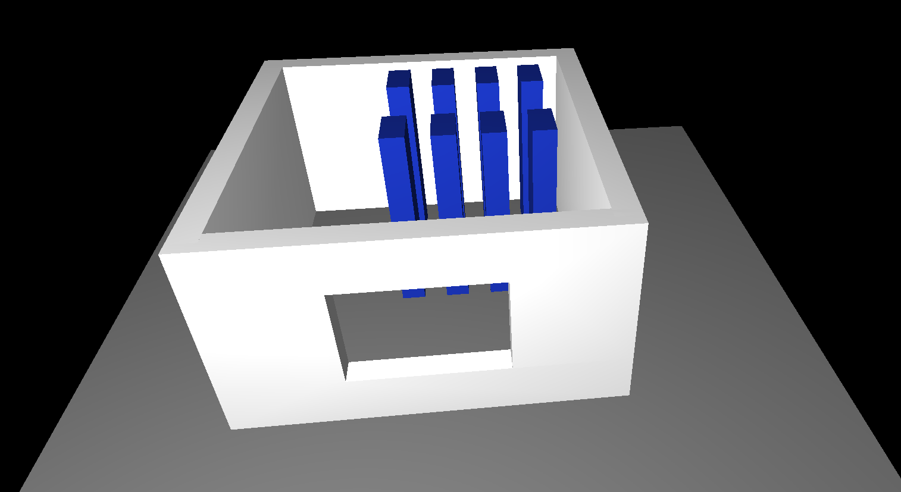

# dataVisualization
关于数据可视化的知识和例子  
## 目录
1. d3 
    * 使用echarts实现基本的图标
    * 写基本的例子*d3*文件夹中
    * 界面截图
    

2. raphael
   2.1 流程
    * 使用raphael实现一个流程
    * 写基本的例子*raphael/流程*文件夹中
    * 界面截图
    
    
   2.2 dragTopo
    * 使用raphael实现一个可拖拽的的拓扑流程
    * 写基本的例子*raphael/dragTopo*文件夹中
    * 界面截图
    
    
   2.3 层级拓扑
    * 使用raphael实现一个层级拓扑，这些拓扑可以实现拖拽、缩放、点击事件、双击事件、右键事件
    * 可以变换很多类型，像这种层级 还有圆环的那种，都可以用这个实现拓扑
    * 写基本的例子*raphael/层级拓扑*文件夹中
    * 界面截图
    
    

3. three
    * 使用three实现3D感觉的正方体
    * 写基本的例子*three/three-3d-circle*文件夹中
    * 界面截图
    

4. three
    * 使用three实现3D模型房子
    * 写基本的例子*raphael/three-3d-room*文件夹中
    * 界面截图
    

